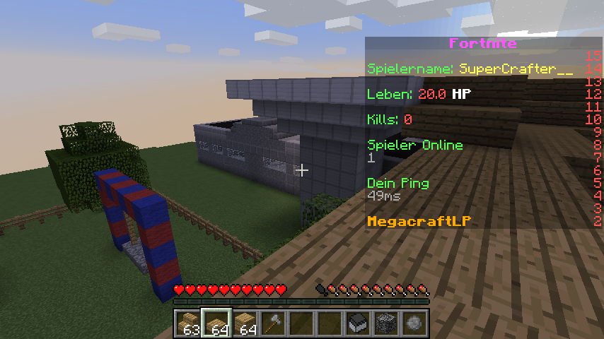

# Fortnite gameplay scripts for SpigotMC servers

## About

This is a ["ScriptCraft"](https://scriptcraftjs.org/) plugin for [SpigotMC](https://www.spigotmc.org/) servers with ScriptCraft installed. It adds some __Fortnite features__ to minecraft, e.g. 

* instant building of floors,
* walls,
* stairs
* and even so called "portaforts"
* It also adds a minigun (for IRON_INGOT type inventory)

As soon as all other players are eliminated, you've won!



It uses [Multiverse](https://dev.bukkit.org/projects/multiverse-core), [QuickBoard](https://www.spigotmc.org/resources/quickboard-free-scoreboard-plugin-scroller-changeable-text-placeholderapi-anti-flicker.15057/), [InstantReset](https://www.spigotmc.org/resources/instantreset.1257/) plugins - and of course ScriptCraft! So make sure you have those installed, too.

This plugin also assumes you have at least the worlds "Wartelobby", "flat_world" and "Tilted".

Make sure to copy the original worlds as templates for __InstantReset__ so that the original worlds can be restored after a game is finished/reset.

You can checkout this game on our own server, https://www.megacraftlp.de

## Howto

Install SpigotMc and the plugins listed above. We use Docker to run SpigotMc on our server, e.g. via Docker Compose:

```yaml
version: '2'
services:

  spigot:
    image: itzg/minecraft-server
    container_name: mc_spigot
    stdin_open: true
    restart: always
    environment:
        TYPE: "SPIGOT"
        VERSION: "1.8.8"
        MAX_PLAYERS: 50
        SPAWN_ANIMALS: "false"
        SPAWN_MONSTERS: "false"
        BUILD_FROM_SOURCE: "true"
        ANNOUNCE_PLAYER_ACHIEVEMENTS: "true"
        ENABLE_COMMAND_BLOCK: "true"
        OPS: AEinstein,FoobarMan
        MODE: "survival"
        FORCE_GAMEMODE: "true"
        PVP: "true"
        EULA: "true"
        MOTD: "Fortnite Minecraft Server - Welcome"
        MEMORY: 1800M
        CONSOLE: "false"
    volumes:
        - /minecraft/data:/data
    ports:
        - 25565:25565
```

Copy the scripts of this repository to _"YOUR_SERVER_MINECRAFT_FOLDER/scriptcraft/plugins/fortnite/"_. Create at least the three maps mentioned above.

Adjust the settings at the top of _"gameplay.js"_.

[Signs](https://github.com/walterhiggins/ScriptCraft/blob/master/docs/API-Reference.md#signs-module) are used to load the Fortnite maps.

Create a new sign, look at it and call

```bash
/js warpSign()
```

to convert it to a Fortnite sign (see _"warpsign.js"_). With every right click, the sign will then bring you to the Fortnite lobby.

The __map launching signs__ inside the "Wartelobby" map can be created with

```bash
/js mapSign1()
/js mapSign2()
```

see _"signs.js"_.

## Playing

As soon as there are enough players in the "Wartelobby" map (see variable "minPlayers" in "gameplay.js"), a game on a random map starts. You can also start a fortnite map manually by right-clicking on one of the map signs. For OPs, there are some ScriptCraft commands to (re)start/stop fortnite games:

```bash
/js fnstart()
/js fnrestart()
/js fnstop()
```

## TODO

* The stairs etc. placement seems to be a bit off sometimes, depending on the current player direction - try to improve "correctAlignment()" in _"events.js"_
* localize the gameplay messages (only German for now)
